# Clinic-Management-System

A lightweight, full-stack clinic management application built with Python, SQLite, and vanilla JavaScript.

## System Diagrams (Mermaid)

### Level 0 (Context Diagram)
A single process showing the entire system and its interactions with external entities.

```mermaid
graph LR
  User["👤 User / Frontend"] -->|HTTP Requests| CMS["⚙️ Clinic Management System"]
  Admin["👨‍💼 Admin"] -->|Manage Data| CMS
  CMS -->|Read/Write| DB[("💾 clinic.db<br/>SQLite")]
  CMS -->|Serve| Assets["📦 Static Assets<br/>HTML/CSS/JS"]
  Email["📧 Email Service<br/>Optional"] -.->|Notify| CMS
  CMS -->|Display| User
```



**Explanation:** The entire CMS system sits at the center, receiving user interactions via HTTP, reading/writing to a SQLite database, and serving static frontend assets. Optional integrations like email notifications can extend functionality.

---

### Level 1 (Major Subsystems & Data Flows)
Breaks the main system into major functional sub-processes, data stores, and data flows.


**Explanation:** The system separates concerns into Frontend (user interface), Backend (request handling), Services (business logic), and Database (persistence). Each service performs CRUD operations on specific data stores.

---

### Level 2 (Detailed Process Decomposition)
Further decomposes Level 1 processes into more granular, detailed steps.

```mermaid
graph LR
  Request["📨 HTTP Request<br/>GET /api/patients"]
  
  Request --> Router["1. Router Match<br/>Path & Method"]
  Router --> ParseReq["2. Parse Request<br/>Headers/Body"]
  ParseReq --> Service["3. Invoke Service<br/>patient_service.py"]
  
  Service --> Query["4. Execute Query<br/>patients_get_all"]
  Query --> DB["5. Query DB<br/>SELECT * FROM patients"]
  
  DB --> Transform["6. Fetch Rows<br/>Convert to Dict"]
  Transform --> BuildResp["7. Build Response<br/>JSON Object"]
  BuildResp --> AddHeaders["8. Add Headers<br/>CORS/Content-Type"]
  AddHeaders --> Send["9. Send Response<br/>HTTP 200"]
  
  Send --> Frontend["10. Frontend<br/>Renders Table"]
```



**Explanation:** A typical request flows through: routing, parsing, service invocation, database query, response building, and finally frontend rendering. Each step is atomic and testable.

---

### ER Diagram (Entity-Relationship Model)
A visual, structural blueprint used in software engineering to model the data requirements of a system.


**Explanation:**
- **PATIENTS:** Core patient records with demographic and contact info.
- **DOCTORS:** Medical staff with specialty and availability schedule.
- **APPOINTMENTS:** Join table linking patients with doctors at specific times.
- **INVOICES:** Billing records tied to a patient and (optionally) a doctor.

**Relationships:**
- One patient can have many appointments and invoices.
- One doctor can attend many appointments and issue many invoices.
- Each invoice may reference both a patient and a doctor.

---

## About This Project

### Overview
**Clinic-Management-System** is a full-stack learning project that demonstrates fundamental CRUD operations, HTTP routing, service-layer architecture, and single-page application design.

### Key Features
- ✅ **Patient Management:** Create, read, update, delete patient records.
- ✅ **Doctor Management:** Manage doctor profiles, specialties, and schedules.
- ✅ **Appointments:** Schedule and track appointments between patients and doctors.
- ✅ **Billing/Invoices:** Generate and manage billing records.
- ✅ **Reports:** View enrollment or billing summaries.
- ✅ **Responsive Frontend:** Vanilla JavaScript SPA with real-time updates.

### Technology Stack
- **Backend:** Python 3.12, built-in `http.server` (no external framework)
- **Database:** SQLite (`clinic.db`)
- **Frontend:** Vanilla JavaScript (ES6+), HTML5, Tailwind CSS
- **Routing:** Client-side SPA router + HTTP method-based backend routes

### Architecture

```
┌─ app.py (entry point, starts server)
├─ router.py (HTTP request dispatcher)
├─ core/ (middleware, request parsing, response helpers)
├─ services/ (patient, doctor, invoice, billing logic)
├─ database/ (connection pool, SQL queries)
├─ controllers/ (legacy placeholder)
├─ tests/ (unit & integration tests)
└─ frontend/ (SPA with pages, components, controllers, services)
    ├─ pages/ (HTML templates for each view)
    ├─ assets/js/
    │  ├─ app.js (bootstrap SPA)
    │  ├─ router/ (client-side routing)
    │  ├─ controllers/ (UI logic per feature)
    │  ├─ components/ (reusable UI elements)
    │  ├─ services/ (API clients)
    │  ├─ state/ (global store)
    │  └─ utils/ (helpers: export, search, DOM)
    ├─ assets/css/ (styling)
    └─ env.js (runtime environment config)
```

### Design Philosophy

1. **Separation of Concerns:** Routing → Services → Queries keeps each layer simple and testable.
2. **Lazy Loading:** Services are imported only when needed, reducing startup time.
3. **Backward Compatibility:** The `billing` service aliases `invoice` to maintain old routes.
4. **Minimal Dependencies:** No external frameworks on the backend; vanilla JS on frontend to maximize learning value.

### Running the Project

```bash
# Install dependencies (optional, mostly built-in)
pip install sqlite-web  # Optional: for SQLite inspection

# Start the server
python app.py

# Visit http://localhost:8000 in your browser

# Run tests
python -m unittest discover -s tests -p "test_*.py" -v
```

### Example API Endpoints

| Method | Endpoint | Purpose |
|--------|----------|---------|
| GET | `/api/patients` | List all patients |
| POST | `/api/patients` | Create new patient |
| GET | `/api/patients/1` | Get patient by ID |
| PUT | `/api/patients/1` | Update patient |
| DELETE | `/api/patients/1` | Delete patient |
| GET | `/api/doctors` | List all doctors |
| POST | `/api/billing` | Create invoice |
| GET | `/api/reports/enrollments` | Get enrollment report |

### File Comments

Every file in the project includes a concise header comment describing:
- **Feature:** What it does
- **Logic:** How it works
- **Connections:** What it interacts with

Example:
```python
# Feature: patient service — database CRUD for patients. Connects: database.queries, controllers.
```

This makes navigation and understanding the codebase much easier.

---

## Future Enhancements

- Add authentication & authorization
- Implement appointment reminders (email/SMS)
- Advanced reporting (charts, exports)
- Multi-clinic support
- Mobile-responsive improvements
- API documentation (Swagger/OpenAPI)

---

**Built for learning. Keep it simple. Understand every line.**
